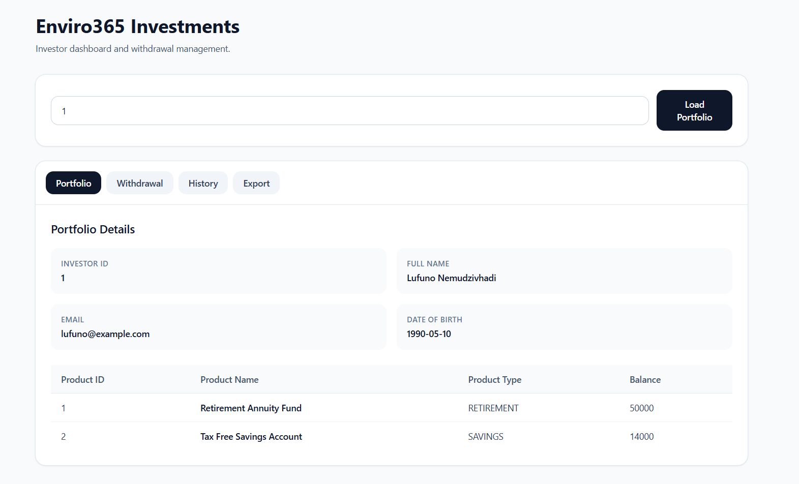
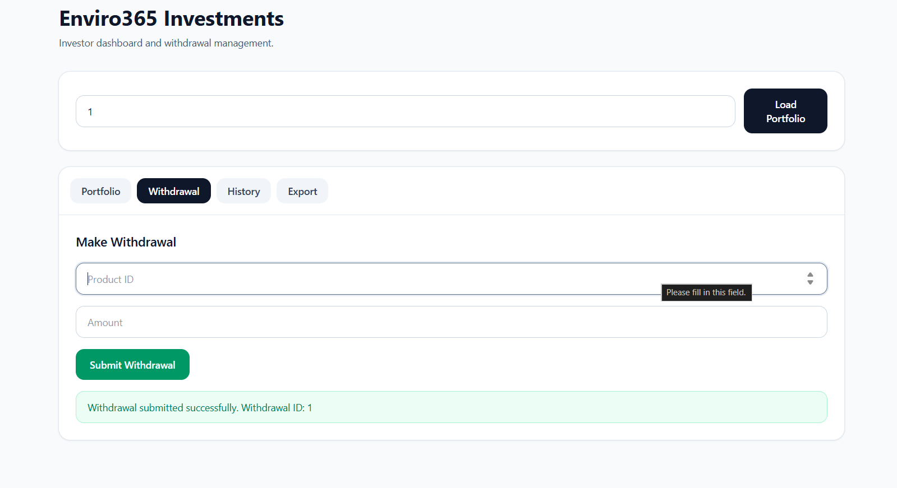
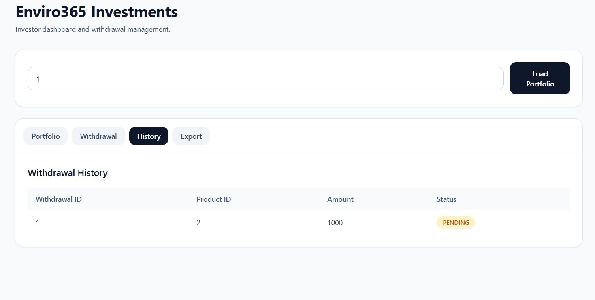
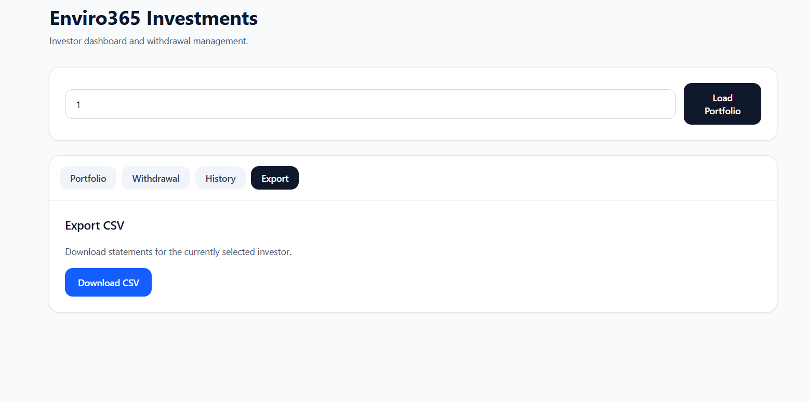

# Enviro365 Investments

A junior full-stack technical assessment project for Enviro365 Investments. The system allows investors to view portfolio details, submit withdrawal notices, validate business rules, and export CSV statements with filtering. These features are explicitly listed as mandatory backend and frontend requirements in the assessment brief.[1]

## Project overview

This project implements a Spring Boot backend and a simple frontend built with HTML, Tailwind CSS, and vanilla JavaScript. The UI includes a portfolio dashboard, withdrawal form, withdrawal history table, and CSV download action, which matches the required frontend scope in the brief.[1]

## Features

### Backend

- Retrieve investor portfolio details and investment products.[1]
- Create withdrawal notices with balance calculations.[1]
- Enforce business rules for withdrawals, including age and balance checks.[1]
- Export CSV statements with filtering.[1]
- Global exception handling for clean API error responses.[1]
- DTO-based API responses for cleaner controller output.[1]

### Frontend

- Load investor portfolio details by investor ID.[1]
- Display investment products in a responsive table.[1]
- Submit withdrawal requests from the UI.[1]
- Show backend validation and business-rule error messages in the UI.[1]
- Display a withdrawal history table in the interface.[1]
- Download CSV statements for the selected investor.[1]

## Business rules

The assessment requires the following withdrawal rules:[1]

- Retirement withdrawals are only allowed if the investor is age 65 or older.[1]
- A withdrawal must not exceed the available balance.[1]
- A withdrawal must not exceed 90% of the balance.[1]
- Proper error handling and user feedback are required.[1]

## Tech stack

| Layer | Technology |
|-------|------------|
| Backend | Java, Spring Boot, Spring Web, Spring Data JPA |
| Database | H2 Database |
| Frontend | HTML, Tailwind CSS, Vanilla JavaScript |
| Build Tool | Maven |
| API Testing | Postman or browser |

The brief also specifically notes the use of H2 and REST best practices.[1]

## Project structure

```text
src/main/java/com/enviro/assessment/junior/lufunonemudzivhadi/
├── config/
│   └── CorsConfig.java
├── controller/
│   ├── PortfolioController.java
│   └── StatementController.java
├── dto/
│   ├── request/
│   └── response/
├── exception/
│   └── GlobalExceptionHandler.java
├── model/
│   ├── InvestmentProduct.java
│   ├── Investor.java
│   └── WithdrawalNotice.java
├── repository/
│   ├── InvestorRepository.java
│   └── WithdrawalNoticeRepository.java
├── service/
│   ├── PortfolioService.java
│   └── StatementService.java
└── Enviro365InvestmentsApplication.java

src/main/resources/
├── application.properties
└── data.sql

frontend/
├── index.html
└── app.js
```

## API endpoints

The system exposes endpoints that support the portfolio, withdrawal, and CSV export flows required by the assessment.[1]

| Method | Endpoint | Description |
|--------|----------|-------------|
| GET | `/api/v1/portfolio/{investorId}` | Load investor portfolio details |
| POST | `/api/v1/portfolio/withdrawals` | Submit a withdrawal notice |
| GET | `/api/v1/statements/export?investorId=1` | Export filtered CSV statements |

## Example request and response

### Load portfolio

**Request**

```http
GET /api/v1/portfolio/1
```

**Example response**

```json
{
  "investorId": 1,
  "firstName": "Lufuno",
  "lastName": "Nemudzivhadi",
  "email": "lufuno@example.com",
  "dateOfBirth": "1990-05-10",
  "investmentProducts": [
    {
      "productId": 1,
      "productName": "Retirement Annuity Fund",
      "productType": "RETIREMENT",
      "balance": 50000
    },
    {
      "productId": 2,
      "productName": "Tax Free Savings Account",
      "productType": "SAVINGS",
      "balance": 14000
    }
  ]
}
```

### Create withdrawal

**Request**

```http
POST /api/v1/portfolio/withdrawals
Content-Type: application/json
```

```json
{
  "productId": 1,
  "amount": 1000
}
```

**Successful response**

```json
{
  "withdrawalId": 1,
  "status": "PENDING",
  "message": "Withdrawal submitted successfully"
}
```

**Example error response**

```json
{
  "message": "Retirement withdrawals are only allowed for investors aged 65 or older"
}
```

### Export CSV

**Request**

```http
GET /api/v1/statements/export?investorId=1
```

The endpoint downloads a CSV file containing filtered withdrawal statement data. CSV export with filtering is a mandatory backend requirement in the brief.[1]

## Frontend usage

The frontend runs as a simple static site and calls the Spring Boot backend using `fetch()`. The browser-based UI is acceptable because the assessment allows HTML/JS for the frontend as long as it connects to backend APIs.[1]

### Main UI sections

- Portfolio tab
- Withdrawal tab
- History tab
- Export tab

### Frontend behavior

- The user enters an investor ID and clicks **Load Portfolio**.
- The frontend calls the portfolio API and renders investor and product data.
- The user can submit a withdrawal from the withdrawal tab.
- If the backend throws a validation or business-rule error, the frontend displays that message in the UI.
- The user can download a CSV statement from the export tab.

## CORS configuration

Because the frontend may run on a different local port such as `5500`, CORS is configured in the backend to allow requests from local development origins. Cross-origin configuration is commonly needed when a frontend on one port calls a Spring Boot API on another port.[2][3]

Example configuration:

```java
@Configuration
public class CorsConfig implements WebMvcConfigurer {
    @Override
    public void addCorsMappings(CorsRegistry registry) {
        registry.addMapping("/api/**")
                .allowedOrigins("http://127.0.0.1:5500", "http://localhost:5500")
                .allowedMethods("GET", "POST", "PUT", "DELETE", "OPTIONS")
                .allowedHeaders("*");
    }
}
```

## Global exception handling

The project uses a `GlobalExceptionHandler` with `@RestControllerAdvice` to return clean JSON error responses for the frontend. Spring detects advice classes through component scanning rather than direct Java references, so these classes may appear unused in the IDE even though they are active at runtime.[4][5][6]

Example:

```java
@RestControllerAdvice
public class GlobalExceptionHandler {

    @ExceptionHandler(IllegalArgumentException.class)
    public ResponseEntity<Map<String, String>> handleIllegalArgumentException(IllegalArgumentException ex) {
        Map<String, String> error = new HashMap<>();
        error.put("message", ex.getMessage());
        return ResponseEntity.badRequest().body(error);
    }
}
```

## Setup instructions

### 1. Clone the repository

```bash
git clone <your-repository-url>
cd <your-project-folder>
```

### 2. Run the backend

```bash
./mvnw spring-boot:run
```

Or on Windows:

```bash
mvnw.cmd spring-boot:run
```

The API should start on:

```text
http://localhost:8080
```

### 3. Run the frontend

Open the `frontend` folder with VS Code Live Server or another local static server. For example, Live Server commonly runs on port `5500`, which is why CORS support is needed during development.[7][2]

Example frontend URL:

```text
http://127.0.0.1:5500/frontend/index.html
```

## H2 database

The assessment specifically requires H2 database usage.[1]

Example H2 console settings if enabled:

```text
URL: jdbc:h2:mem:testdb
Username: sa
Password:
```

## Validation and testing ideas

Good test cases for this project include:

- Load an existing investor portfolio.
- Try loading a non-existent investor ID.
- Submit a valid withdrawal amount.
- Submit a withdrawal amount greater than the balance.
- Submit a withdrawal amount greater than 90% of the balance.
- Try a retirement withdrawal for an investor younger than 65.
- Download a CSV statement for a selected investor.

These test cases align closely with the business rules and required backend/frontend behavior in the brief.[1]

## Advanced requirements covered

The brief asks candidates to implement at least three advanced items from a supplied list.[1]

This project includes:

- Global exception handling.[1]
- DTO layer.[1]
- Input validation.[1]
- UI validation.[1]

## AI usage disclosure

The assessment permits AI-assisted development, but it also states that the candidate must disclose AI usage and be able to explain all generated code and design choices.[1]

Suggested disclosure text:

> AI tools were used to assist with boilerplate generation, API structure suggestions, frontend UI scaffolding, and documentation drafting. All generated output was reviewed, adjusted, tested, and explained in the final solution by the candidate.[1]

## Screenshots

Below are screenshots of the application UI:

### Portfolio Dashboard


### Withdrawal Form

.png)


### Withdrawal History Table


### CSV Export UI


The brief explicitly asks for a README with setup instructions, API documentation, AI usage disclosure, and screenshots.[1]

## Notes

- Use clean package naming: `com.enviro.assessment.junior.yourname`, as required by the brief.[1]
- Follow REST best practices in controller design and response handling.[1]
- Keep comments and explanations ready for the follow-up interview discussion mentioned in the assessment notes.[1]
